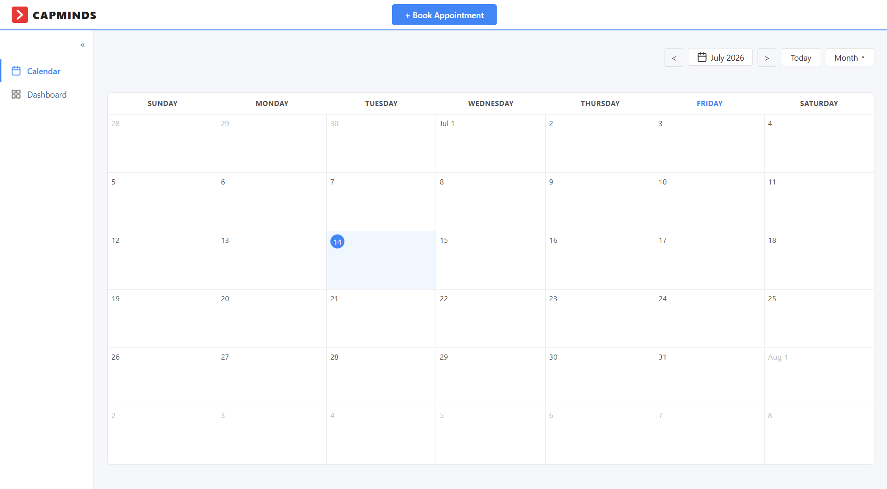
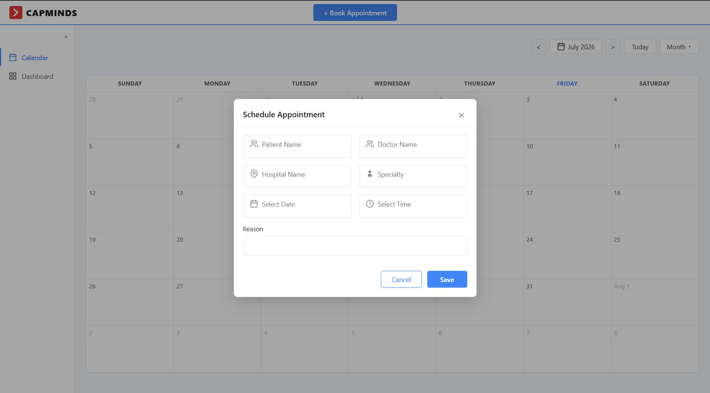

# Appointment Scheduler Task

A responsive appointment scheduling web application built with vanilla HTML, CSS, and JavaScript — no frameworks or libraries used.

## Demo

https://github.com/neokazer/Appointment_scheduler_Task/blob/main/demo.mp4

## Features

- Book new appointments through a modal form (Patient Name, Doctor Name, Hospital Name, Specialty, Date, Time, Reason)
- Edit and delete existing appointments
- Calendar view (month view) showing appointments on their scheduled date
- Navigate between months, jump to "Today"
- Live search by patient name and doctor name
- Filter appointments by date / date range
- Form validation for required fields
- Data persistence using `localStorage`
- Fully responsive — works on mobile, tablet, and desktop

## Tech Stack

- HTML5
- CSS3 (Flexbox, Grid, Media Queries)
- Vanilla JavaScript (ES6)
- No external frameworks, libraries, or plugins

## Project Structure

```
Appointment_scheduler_Task/
├── index.html
├── style.css
├── script.js
├── demo.mp4
└── README.md
```

## How to Run

1. Clone the repository
   ```bash
   git clone https://github.com/neokazer/Appointment_scheduler_Task.git
   ```
2. Open `index.html` directly in your browser (no build step or server required)

## Screenshots

**Calendar View**

Shows all appointments laid out in a monthly calendar with navigation controls.

**Schedule Appointment**

Clicking "Book Appointment" opens a modal to add a new appointment with all required details.

## Author

**Kannan S**
[GitHub](https://github.com/neokazer)

https://github.com/user-attachments/assets/dae3a06b-257e-4d02-a0b0-bbd3690b87cb


   
